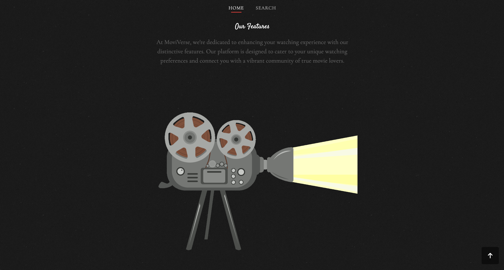
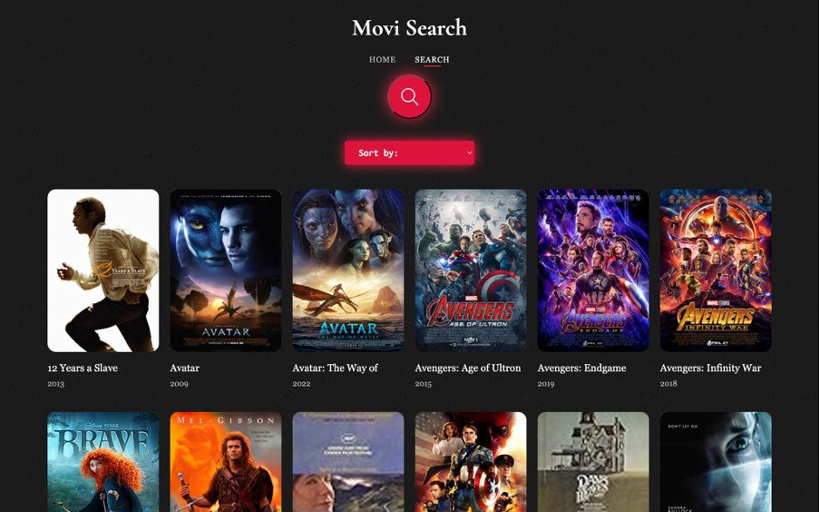
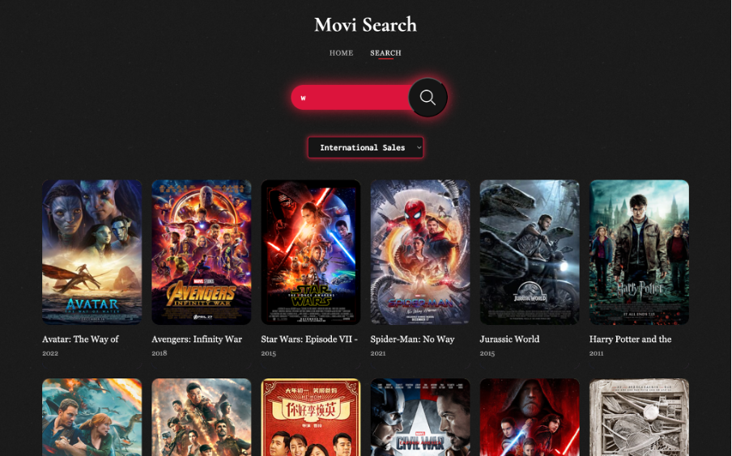

### Project Description
This project aims to develop an interactive website that allows users to explore movie data using two main local datasets: Highest Hollywood Grossing Movies and IMDB Top 1000. Additionally, the dataset is also retrieved remotely from Wikidata.
 
The application is designed to present structured information, providing comprehensive details about various films. Users can easily browse and compare movies based on specific preferences, such as genre or release year. With an intuitively designed interface, the application aims to offer a more informative browsing experience, helping users understand the connections and insights behind the movies. This project is developed as part of the Knowledge Graph course assignment for the 2024/2025 academic term.

### Glimpse of What We Create

